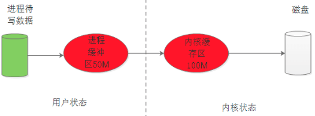
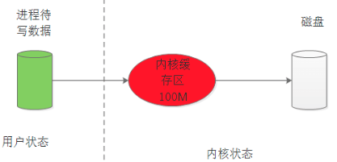
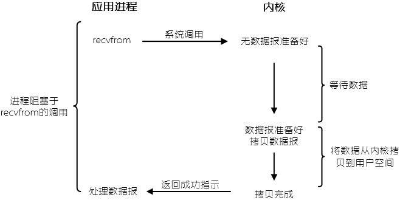
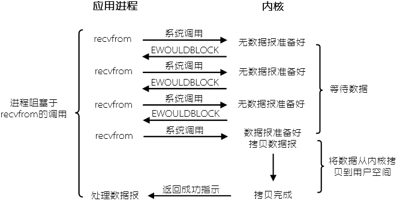
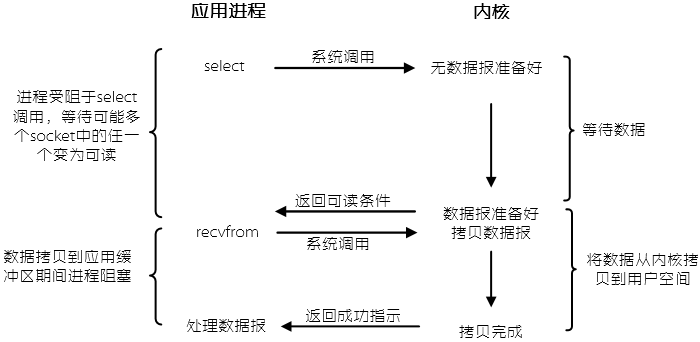
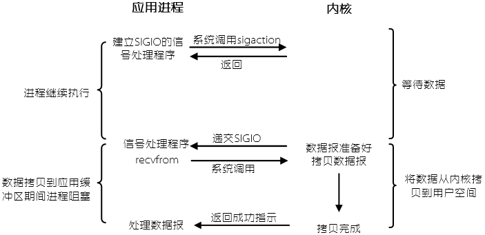
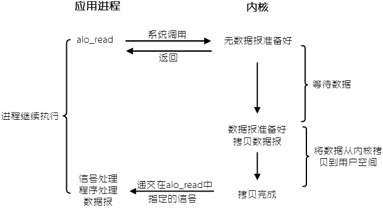
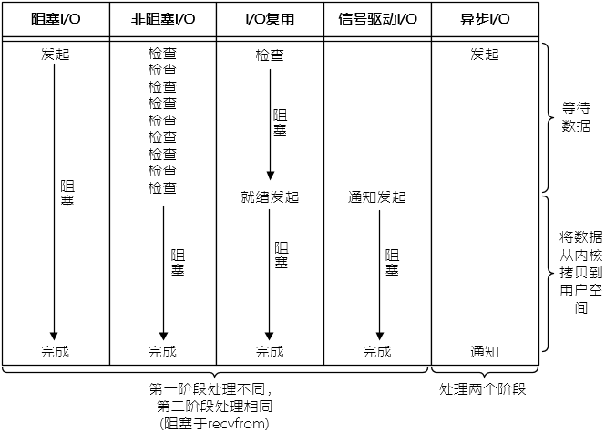

当TCP客户端同时处理多个IO，如标准输入和TCP socket，我们会遇到的问题就是客户端可能会阻塞在标准输入(如`fget()`)上。这时，服务器虽然正确的给客户端发送了报文，但客户端进程正阻塞在`fget()`上。要解决这样的问题，我们需要一种机制，进程要有一种能预先告知内核的能力，让内核一旦发现进程指定的一个或者多个I/O条件就绪(也就是说输入已准备好被读取，或者描述字已能承接更多的输出)，它就通知进程，这种机制就叫做I/O复用(I/O multiplexing)。  

I/O复用典型使用在下列网络应用场合：  

* 当客户处理多个描述字(通常是交互式输入和网络套接字接口)时，必须使用I/O复用；  
* 一个客户同时处理多个套接字接口；  
* 如果一个TCP服务器既要处理监听socket，又要处理已连接的socket，一般就要I/O复用；  
* 如果一个如武器既要处理TCP，又要处理UDP，一般就要使用I/O复用；  
* 如果一个服务器要处理多个服务或者多个协议，一般就要使用I/O复用  

### 基础知识  

**+ 用户空间和内核空间**  

现在操作系统都采用虚拟寻址，处理器先产生一个虚拟地址，通过地址翻译成物理地址(内存的地址)，再通过总线的传递，最后处理器拿到某个物理地址返回的字节。  

对于32位操作系统而言，它的寻址空间(虚拟存储空间)为4G(2^32^)。  

***核空间***：在Linux中，将最高的1G字节(从虚拟地址0xC0000000到0xFFFFFFFF)，供内核使用，称为“内核空间”；  

***用户空间***：每个进程都有自己的内核栈，当进程在执行用户自己的代码时，则称其处于用户运行态(用户态)。  

因为每个进程都可以通过系统调用进入内核，因此，Linux内核由系统内的所有进程共享。于是，从具体进程角度来看，每个进程可以拥有4GB的虚拟空间。  

* 进程寻址空间0~4G(32位OS)  
* 进程在用户态智能访问0\~3G，只有进入内核态才能访问3G\~4G  
* 进程通过系统调用进入内核态  
* 每个进程虚拟空间的3G\~4G部分是相同的  

**+ 进程上下文切换**  

为了控制进程的执行，内核执行必须有能力挂起正在CPU上运行的进程，并恢复以前挂起的某个进程的执行。这种行为被称为***进程切换***。因此可以说，任何进程都是在操作系统内核的支撑下运行的，是与内核紧密相关的。  

从一个进程的运行转到另一个进程上运行，这个过程中经过下面这些变化：  

1. 保存当前进程A的上下文。上下文就是内核在此唤醒当前进程时所需的状态，由一些对象(程序计数器、状态寄存器、用户栈等各种内核数据结构)的值组成，这些值包括描绘地址空间的页表、包含进程相关信息的进程表、文件表等；  
2. 切换页全局目录以安装一个新的地址空间；  
3. 恢复进程B的上下文  

上下文切换是一个比较消耗资源的过程。  

**+ 直接I/O和 缓存I/O**  

缓存I/O又被称作标准I/O，大多数文件系统的默认I/O操作都是缓存I/O。在Linux缓存I/O机制中，以write为例，数据会先被拷贝进缓冲区，再拷贝到操作系统内核的缓冲区，最后才会写到存储设备中去。  

  

直接I/O就是应用程序直接访问磁盘数据，而不经过内核缓冲区，这样做的目的是减少一次从内核缓冲区到用户程序缓存的数据复制。比如说数据库管理系统这类应用，它们更倾向于选择它们自己的缓存机制，因为数据库管理系统往往比操作系统更了解数据库存放的数据，数据库管理系统可以提供一种更加有效的缓存机制来提高数据库中数据的存储性能。  

  

> ***缓存I/O的优点***：
>
> * 在一定程度上分离了内核空间和用户空间，保护系统本身的运行安全
> * 可以减少读盘的次数，从而提高性能
>
> ***缓存I/O的缺点***：数据传输过程中需要在应用程序地址空间和缓存之间多次数据拷贝操作，这些数据拷贝操作所带来的CPU以及内存的开销是非常大的
>
> ***直接I/O的缺点***：如果访问的数据不在应用程序缓存中，那么每次数据都会直接从磁盘加载，这种直接加载会非常缓慢。直接I/O与异步I/O结合使用会得到比较好的性能（异步I/O：访问数据的线程发出请求后，线程会接着去处理其他事情，而不是阻塞等待）。  

### I/O模式    

对于一次I/O访问，如read，数据先会被拷贝到操作系统内核的缓冲区中，然后才会从操作系统内核的缓冲区拷贝到应用程序的缓冲区，最后交给进程。所以，一个输入操作通常包括两个不同的阶段：  

1. 等待数据准备好；  
2. 将数据从内核拷贝到进程中  
  
对于一个socket的输入操作，第一步通常是等待数据从网络到达，当所等待的分组到达时，它被拷贝到内核的某个缓冲区。第二步就是把数据从内核缓冲区拷贝到应用进程缓冲区。Unix下有5种可用的I/O模型：  

- 阻塞I/O  
- 非阻塞I/O  
- I/O多路复用  
- 信号驱动I/O  
- 异步I/O  
  
**1) 阻塞I/O**

I/O模型中使用最多的就是阻塞I/O，很多socket接口缺省状态下都是阻塞的。我们以UDP为例，可以得到如下所示的工作模型：  

  

这里我们把`recvfrom`函数视为系统调用，因为我们正在区分应用进程和内核。不论他具体是如何实现的（在源自Berkeley的内核上是作为系统 调用，在System V内核上是作为调用系统getmsg的函数），一般都有一个从在应用进程空间中运行到在内核空间中运行的切换，一段时间之后再切换回来。  

进程调用`recvfrom`，其系统调用直到数据报到达且被拷贝到应用进程的缓冲区或者发生错误才返回（最常见的错误就是系统调用被信号中断）。我们说进程在从调用`recvfrom`开始到它返回的整段时间内是被阻塞的。`recvfrom`成功返回后，应用程序进程开始处理数据报。  

**2) 非阻塞I/O**  

进程把一个socket设置成非阻塞是在通知内核：当所请求的I/O操作非得把本进程投入睡眠才能完成时，不要把本进程投入睡眠，而是返回一个错误。  

  

如上图所示，前三次调用`recvfrom`时，没有数据可返回，一次你内核转而立即返回一个`EWOULDBLOCK`错误。第四次调用`recvfrom`时已有一个数据报准备好，它被拷贝到应用进程缓冲区，`recvfrom`于是成功返回，我们接着处理数据。  

当一个应用进程像这样对一个非阻塞描述字循环调用`recvfrom`时，我们称之为**轮询(polling)**。应用进程持续轮询内核，以查看某个操作是否就绪。这么做往往耗费大量CPU时间，不过这种模型偶尔也会遇到，通常是在只专门提供某种功能的系统中才有。  

**3) I/O复用**  

有了I/O复用，我们就可以调用`select`或`poll`，阻塞在这两个系统调用中的某一个之上，而不是阻塞在真正的I/O系统调用上，下图展示了I/O复用模型：  

  

我们阻塞于`select`调用，等待socket接口变为可读。当`select`返回socket接口可读这一条件时，我们调用`recvfrom`把所读数据报拷贝到应用进程缓冲区。  

然而，相比于阻塞IO，I/O多路复用好像并没有什么优势，而且，由于I/O多路复用需要`select`和`recvfrom`两个系统调用，反而稍显劣势。实际上，使用I/O多路复用的优势体现在同时处理多个连接上。  

> 与I/O复用密切相关的另一种I/O模型是多线程中使用阻塞I/O。这种模型与上述模型极为相似，代替使用`select`阻塞在多个文件描述字上的是***使用多个线程，每个文件描述字一个线程***，这样每个线程都可以自由地调用诸如`recvfrom`之类的阻塞式I/O系统调用了  

**4) 信号驱动I/O**  

我们也可以用信号，让内核在描述字就绪时发送SIGIO信号通知我们。我们称这种模型为信号驱动I/O。  

  

首先，我们开启socket的信号驱动I/O功能，并通过`sigaction`系统调用安装一个信号处理函数。该系统调用将立即返回，我们的进程继续工作，也就是说它没有被阻塞。当数据报准备好读取时，内核就为该进程产生 一个SIGIO信号。我们随后既可以在信号处理函数中调用`recvfrom`读取数据报，并通知主循环数据已准备好待处理，也就是立即通知主循环，让它读取数据报。  

无论如何处理SIGIO信号，这个模型的优势在于等待数据报到达期间，进程不被阻塞。主循环可以继续执行，只要不时等待来自信号处理函数的通知：既可以是数据已准备好被处理，也可以是数据报已准备好被读取。  

**5) 异步I/O**  

异步I/O由POSIX规范定义，后来由演变成当前POSIX规范的各种早期标准定义的实时函数中存在的差异已经取得一致。一般来说，这些函数的工作机制是：告知内核启动某个操作，并让内核在整个操作（包括将数据从内核拷贝到我们自己的缓冲区）完成后通知我们。这种模型信号驱动模型的区别在于：信号驱动I/O是由内核通知我们何时可以启动一个I/O操作，而异步I/O模型是由内核通知我们I/O操作何时完成。  

  

我们调用`aio_read`函数（POSIX异步I/O函数以`aio_`或`lio_`，给内核传递描述字，缓冲区指针、缓冲区大小（与`read`相同的三个参数）、文件偏移（与`lseek`类似），并告诉内核当整个操作完成时何时通知我们。该系统调用立即返回，在等待I/O完成期间，我们的进程不被阻塞。  

> 不过目前支持POSIX异步I/O模型的系统仍然比较罕见  

**> 各种I/O模型的比较**  

下图对比了上述5种不同的I/O模型，可以看出前4种模型的主要区别在于第一阶段，因为他们的第二阶段是一样的：在数据从内核拷贝到调用者的缓冲区期间，进程阻塞于`recvfrom`调用。相反，异步I/O模型在这两个阶段都要处理，从而不同于其它4种模型。  

  

**> 同步I/O与异步I/O**  

POSIX把这两个术语定义如下：  

* 同步I/O操作导致请求阻塞，知道I/O操作完成；  
* 异步I/O操作不导致请求进程阻塞。  
  
根据上述定义，我们的前4种模型——阻塞I/O模型、非阻塞I/O模型、I/O复用模型和信号驱动I/O模型都是同步I/O模型，因为其中真正的I/O操作(`recvfrom`)将阻塞进程。只有异步I/O模型与POSIX定义的异步I/O相匹配。  